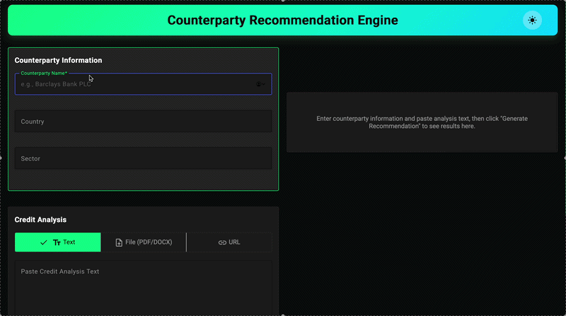

# Counterparty Recommendation Engine

A production-style MVP system that assists credit analysts by transforming unstructured credit analysis text into structured insights and generating recommendation memos.

## Features

- **Web UI**: Angular-based interface for credit analysts
- **Text Processing**: Extract structured sections from unstructured credit analysis text
- **Signal Detection**: Detect financial signals (CET1, NPL, LCR, ROAE, cost-to-income, loan-to-deposit ratios)
- **Risk Scoring**: Compute rule-based risk scores (asset quality, liquidity, capitalisation, profitability)
- **AI-Powered Memos**: Generate recommendation memos using LLM (via OpenRouter API)
- **Export**: Export recommendations as PDF or DOCX
- **RESTful API**: FastAPI backend with automatic documentation
- **Database**: SQLite for persistence


## 🎥 Demo

Below is a quick walkthrough of the Counterparty Recommendation Engine.



## Quick Start

### Backend Setup

1. Install dependencies:
```bash
pip install -r requirements.txt
```

2. Download spacy model:
```bash
python -m spacy download en_core_web_sm
```

3. Configure environment variables:
```bash
cp .env.example .env
# Edit .env and add your OPENROUTER_API_KEY
```

4. Run the application:
```bash
uvicorn app.main:app --reload
```

The API will be available at `http://localhost:8000`

API documentation: `http://localhost:8000/docs`

### Frontend Setup

1. Install Angular CLI:
```bash
npm install -g @angular/cli
```

2. Navigate to frontend directory and install dependencies:
```bash
cd counterparty-ui
npm install
```

3. Start the frontend:
```bash
npm start
```

The UI will be available at `http://localhost:4200`

## Using the Application

1. Open `http://localhost:4200` in your browser
2. Enter counterparty information (name, country, sector, model ratings)
3. Paste credit analysis text
4. Click "Generate Recommendation"
5. View structured analysis, scores, and recommendation memo
6. Export as PDF or DOCX

## Running Tests

```bash
pytest
```

## API Endpoints

- `POST /analyze` - Submit counterparty analysis
- `GET /analysis/{id}` - Retrieve analysis results
- `GET /recommendation/{id}` - Retrieve recommendation memo
- `POST /export/pdf` - Export memo as PDF
- `POST /export/docx` - Export memo as DOCX

## Project Structure

```
counterparty_engine/
├── app/                  # Backend (Python/FastAPI)
│   ├── api/             # FastAPI routes and schemas
│   ├── models/          # SQLAlchemy database models
│   ├── services/        # Business logic services
│   ├── config.py        # Configuration
│   └── main.py          # FastAPI application
├── counterparty-ui/     # Frontend (Angular/TypeScript)
│   └── src/
│       └── app/
│           ├── models/          # TypeScript interfaces
│           ├── services/        # API services
│           └── pages/
│               └── dashboard/   # Main UI component
├── tests/               # Backend test suite
├── .env                 # Environment variables
└── requirements.txt     # Python dependencies
```

## Architecture

### Backend Stack
- **Framework**: FastAPI (Python)
- **Database**: SQLite + SQLAlchemy ORM
- **NLP**: spacy
- **LLM**: OpenRouter API
- **Export**: reportlab (PDF), python-docx (DOCX)

### Frontend Stack
- **Framework**: Angular 17
- **UI Library**: Angular Material
- **HTTP**: HttpClient
- **State**: RxJS Observables

## Example Usage

### Via Web UI
1. Open http://localhost:4200
2. Fill in the form and paste analysis text
3. Click "Generate Recommendation"

### Via API

```python
import httpx

# Submit analysis
response = httpx.post("http://localhost:8000/analyze", json={
    "counterparty": {
        "name": "Example Bank",
        "country": "USA",
        "sector": "Banking",
        "intrinsic_hrc": 3.5,
        "intrinsic_pd": 0.02,
        "counterparty_hrc": 3.2,
        "counterparty_pd": 0.015
    },
    "analysis_input": {
        "analysis_text": "Company Profile: Example Bank is a leading financial institution..."
    }
})

result = response.json()
print(f"Analysis ID: {result['analysis_id']}")
print(f"Memo: {result['memo']}")
```
